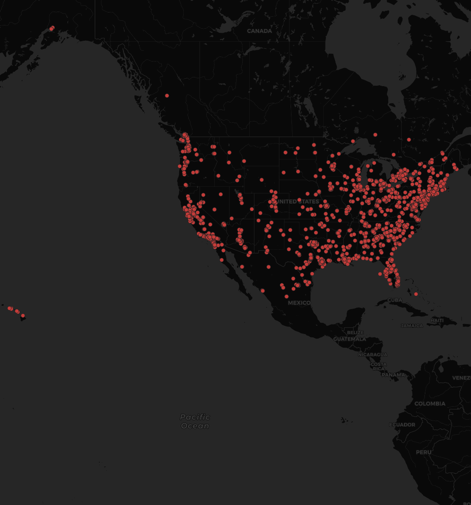

## Geo458 lab2 tagged Tweet

### As one of the hottest topic on internet, the Gamestop(GME) stock has a unprecedented stock rise by Reddit.The map is a 60 seconds moniter of twitter geographic location with the GME tag in America.There is a signiciant cluster on the geographic correlated with population distrubution.Both population dense region in east and west coast has a signiciant high amount of publication.The central U.S. with less population has less activity.This indicatess that the GME tag is well known on internet in the entire U.S. without geographic favor.
